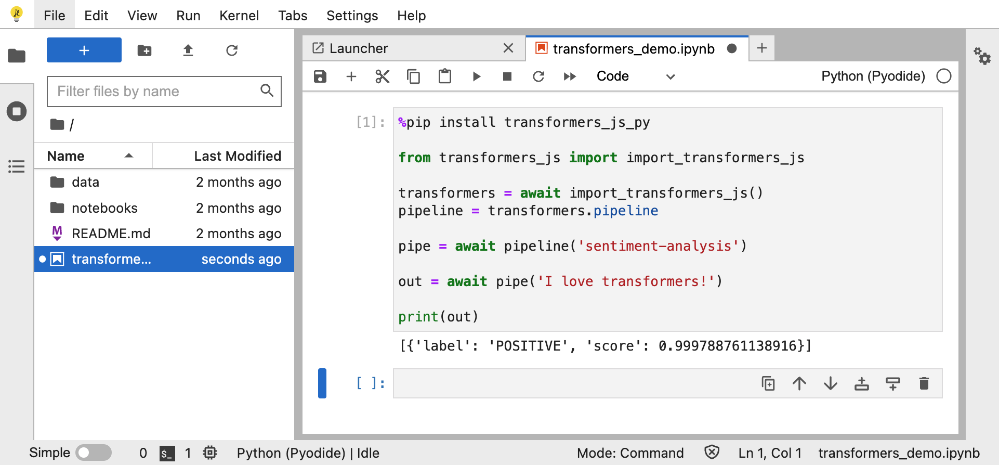
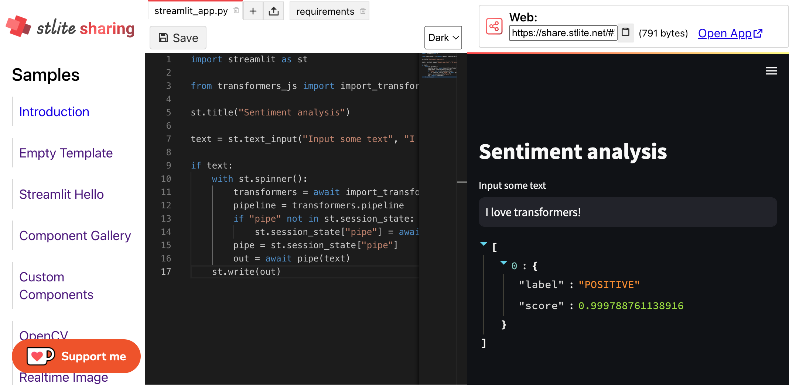
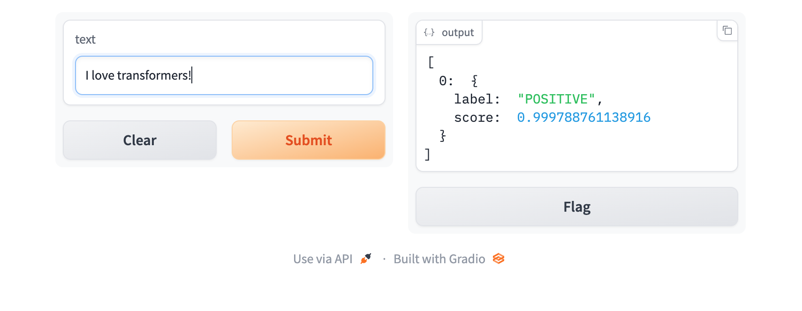
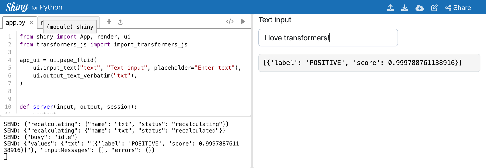
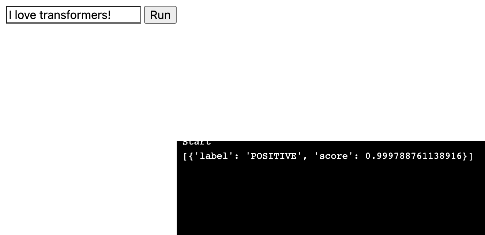
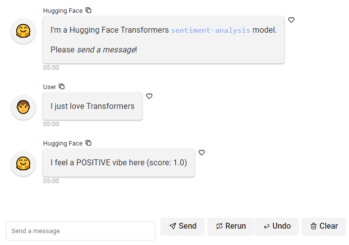
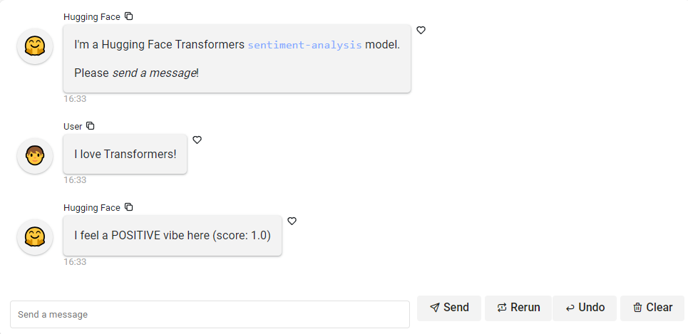

# Transformers.js.py 🤗

[](https://github.com/whitphx/transformers.js.py/actions/workflows/main.yml)
[](https://pypi.org/project/transformers-js-py/)

**Use [Transformers.js](https://huggingface.co/docs/transformers.js/index) on [Pyodide](https://pyodide.org/en/stable/) and Pyodide-based frameworks such as [JupyterLite](https://jupyterlite.readthedocs.io/en/latest/), [stlite (Streamlit)](https://github.com/whitphx/stlite), [Shinylive (Shiny for Python)](https://shiny.posit.co/py/docs/shinylive.html), [PyScript](https://pyscript.net/), [HoloViz Panel](https://panel.holoviz.org), and so on.**

The original [Transformers](https://huggingface.co/docs/transformers/index) can't be used in a browser environment. [Transformers.js](https://huggingface.co/docs/transformers.js/index) is a JavaScript version of Transformers that can be installed on browsers, but we can't use it from Pyodide.
This package is **a thin wrapper of Transformers.js to proxy its API to Pyodide**.

## API

The API is more like Transformers.js than the original Transformers.

<table>
<tr>
<th width="50%" align="center"><b>Transformers.js</b></th>
<th width="50%" align="center"><b>Transformers.js.py</b></th>
</tr>
<tr>
<td>

```javascript
import { pipeline } from '@xenova/transformers';

// Allocate a pipeline for sentiment-analysis
let pipe = await pipeline('sentiment-analysis');

let out = await pipe('I love transformers!');
// [{'label': 'POSITIVE', 'score': 0.999817686}]
```

</td>
<td>

```python
from transformers_js_py import import_transformers_js

transformers = await import_transformers_js()
pipeline = transformers.pipeline

# Allocate a pipeline for sentiment-analysis
pipe = await pipeline('sentiment-analysis')

out = await pipe('I love transformers!')
# [{'label': 'POSITIVE', 'score': 0.999817686}]
```

</td>
</tr>
</table>

See the [Transformers.js document](https://github.com/xenova/transformers.js/) for available features.

### Special Case: `as_url()`
Certain methods of Transformers.js accept a URL as an input. However, when using Transformers.js.py on Pyodide, there may be instances where we want to pass a local file path from the virtual file system, rather than a URL. In such scenarios, the `as_url()` function can be used to convert a local file path into a URL.

```python
# Example
from transformers_js import import_transformers_js, as_url

transformers = await import_transformers_js()
pipeline = transformers.pipeline
pipe = await pipeline('image-classification')

local_image_path = "/path/to/image.jpg"

input_url = as_url(local_image_path)  # Converts a local file path into a URL that can be passed to `pipe()`
result = await pipe(input_url)
```

## Examples

### JupyterLite



👉Try this code snippet on https://jupyter.org/try-jupyter/lab/index.html

```python
%pip install transformers_js_py

from transformers_js_py import import_transformers_js

transformers = await import_transformers_js()
pipeline = transformers.pipeline

pipe = await pipeline('sentiment-analysis')

out = await pipe('I love transformers!')

print(out)
```

### stlite (Serverless Streamlit)

[](https://edit.share.stlite.net/#!ChBzdHJlYW1saXRfYXBwLnB5EpMEChBzdHJlYW1saXRfYXBwLnB5Ev4DCvsDaW1wb3J0IHN0cmVhbWxpdCBhcyBzdAoKZnJvbSB0cmFuc2Zvcm1lcnNfanMgaW1wb3J0IGltcG9ydF90cmFuc2Zvcm1lcnNfanMKCnN0LnRpdGxlKCJTZW50aW1lbnQgYW5hbHlzaXMiKQoKdGV4dCA9IHN0LnRleHRfaW5wdXQoIklucHV0IHNvbWUgdGV4dCIsICJJIGxvdmUgdHJhbnNmb3JtZXJzISIpCgppZiB0ZXh0OgogICAgd2l0aCBzdC5zcGlubmVyKCk6CiAgICAgICAgdHJhbnNmb3JtZXJzID0gYXdhaXQgaW1wb3J0X3RyYW5zZm9ybWVyc19qcygpCiAgICAgICAgcGlwZWxpbmUgPSB0cmFuc2Zvcm1lcnMucGlwZWxpbmUKICAgICAgICBpZiAicGlwZSIgbm90IGluIHN0LnNlc3Npb25fc3RhdGU6CiAgICAgICAgICAgIHN0LnNlc3Npb25fc3RhdGVbInBpcGUiXSA9IGF3YWl0IHBpcGVsaW5lKCdzZW50aW1lbnQtYW5hbHlzaXMnKQogICAgICAgIHBpcGUgPSBzdC5zZXNzaW9uX3N0YXRlWyJwaXBlIl0KICAgICAgICBvdXQgPSBhd2FpdCBwaXBlKHRleHQpCiAgICBzdC53cml0ZShvdXQpGhJ0cmFuc2Zvcm1lcnNfanNfcHk,)

[👉 Online Demo](https://edit.share.stlite.net/#!ChBzdHJlYW1saXRfYXBwLnB5EpMEChBzdHJlYW1saXRfYXBwLnB5Ev4DCvsDaW1wb3J0IHN0cmVhbWxpdCBhcyBzdAoKZnJvbSB0cmFuc2Zvcm1lcnNfanMgaW1wb3J0IGltcG9ydF90cmFuc2Zvcm1lcnNfanMKCnN0LnRpdGxlKCJTZW50aW1lbnQgYW5hbHlzaXMiKQoKdGV4dCA9IHN0LnRleHRfaW5wdXQoIklucHV0IHNvbWUgdGV4dCIsICJJIGxvdmUgdHJhbnNmb3JtZXJzISIpCgppZiB0ZXh0OgogICAgd2l0aCBzdC5zcGlubmVyKCk6CiAgICAgICAgdHJhbnNmb3JtZXJzID0gYXdhaXQgaW1wb3J0X3RyYW5zZm9ybWVyc19qcygpCiAgICAgICAgcGlwZWxpbmUgPSB0cmFuc2Zvcm1lcnMucGlwZWxpbmUKICAgICAgICBpZiAicGlwZSIgbm90IGluIHN0LnNlc3Npb25fc3RhdGU6CiAgICAgICAgICAgIHN0LnNlc3Npb25fc3RhdGVbInBpcGUiXSA9IGF3YWl0IHBpcGVsaW5lKCdzZW50aW1lbnQtYW5hbHlzaXMnKQogICAgICAgIHBpcGUgPSBzdC5zZXNzaW9uX3N0YXRlWyJwaXBlIl0KICAgICAgICBvdXQgPSBhd2FpdCBwaXBlKHRleHQpCiAgICBzdC53cml0ZShvdXQpGhJ0cmFuc2Zvcm1lcnNfanNfcHk,) : try out this code online.

```python
import streamlit as st

from transformers_js_py import import_transformers_js

st.title("Sentiment analysis")

text = st.text_input("Input some text", "I love transformers!")

if text:
    with st.spinner():
        transformers = await import_transformers_js()
        pipeline = transformers.pipeline
        if "pipe" not in st.session_state:
            st.session_state["pipe"] = await pipeline('sentiment-analysis')
        pipe = st.session_state["pipe"]
        out = await pipe(text)
    st.write(out)
```

### Gradio-lite



Save the following code as an HTML file and open it in a browser.

```html
<!DOCTYPE html>
<html lang="en">
<head>
  <script type="module" crossorigin src="https://cdn.jsdelivr.net/npm/@gradio/lite/dist/lite.js"></script>
  <link rel="stylesheet" href="https://cdn.jsdelivr.net/npm/@gradio/lite/dist/lite.css" />
  <title>Transformers.js with Gradio-lite</title>
  <style>
    html, body {
      margin: 0;
      padding: 0;
      height: 100%;
      width: 100%;
    }
    gradio-lite {
      height: 100%;
      width: 100%;
    }
  </style>
</head>
<body>
<gradio-lite>

<gradio-requirements>
transformers_js_py
</gradio-requirements>

<gradio-file name="app.py" entrypoint>
import gradio as gr
from transformers_js_py import import_transformers_js

transformers = await import_transformers_js()
pipeline = transformers.pipeline

pipe = await pipeline('sentiment-analysis')

async def process(text):
    return await pipe(text)

demo = gr.Interface(fn=process, inputs="text", outputs="json")

demo.launch()
</gradio-file>

</gradio-lite>
</body>
</html>
```

[👉 Online demo](https://huggingface.co/spaces/abidlabs/gradio-lite-classify)

For more details about Gradio-lite, please read [Gradio-Lite: Serverless Gradio Running Entirely in Your Browser (huggingface.co)](https://huggingface.co/blog/gradio-lite).

### Shinylive

[](https://shinylive.io/py/editor/#code=NobwRAdghgtgpmAXGKAHVA6VBPMAaMAYwHsIAXOcpMAMwCdiYACAZwAsBLCbJjmVYnTJMAgujxM6lACZw6EgK4cAOhHqMmZOlAgsag+HRYB9AFYte-QcL4ChxrTr0G5J86tVpUxpUwC8TEpYUADmcMY0ADZK0gAUqkyJgRwYXKgKZA5wAB5k8WAUucr4TMUAKjk2EOlkxRKokVCEcGzEkbJ0fsUAouRympXFAJR4CUlBxBk1WbnGAG5yAEZQZHz5ZEVgI6pDHhCqsjSscgt0sWkZEpNkNRIscCwsHKRDiGOJAALXNe9MH1IQDoYQq1CBJJhQFjYCCEJiHTS5WKvX7gjhHCDEKo1YGVJFvMHgwmJKRkBR0MHFSn7AlExy6fR0QwWAJQADuUA4Nis9jpzkZrjMLCRKKSqA4qDgkS4cH8mm09JcRiw4sl0r2RMSYolsrZHOEWtVEDg+Xu5D4lDIAFodFBItgnixhuqNdcdezOUwDedqhkcYihrtqRrJHBSeTWFpYtdA3svLKxKhYl4fBw7ic5BJZIsFCE-GU6Ao4IGwABfPDgaDwahSACOSik8HILGBuXwRFIFCoyF5DKZlvMlpwpYAukA)

[👉 Online demo](https://shinylive.io/py/editor/#code=NobwRAdghgtgpmAXGKAHVA6VBPMAaMAYwHsIAXOcpMAMwCdiYACAZwAsBLCbJjmVYnTJMAgujxM6lACZw6EgK4cAOhHqMmZOlAgsag+HRYB9AFYte-QcL4ChxrTr0G5J86tVpUxpUwC8TEpYUADmcMY0ADZK0gAUqkyJgRwYXKgKZA5wAB5k8WAUucr4TMUAKjk2EOlkxRKokVCEcGzEkbJ0fsUAouRympXFAJR4CUlBxBk1WbnGAG5yAEZQZHz5ZEVgI6pDHhCqsjSscgt0sWkZEpNkNRIscCwsHKRDiGOJAALXNe9MH1IQDoYQq1CBJJhQFjYCCEJiHTS5WKvX7gjhHCDEKo1YGVJFvMHgwmJKRkBR0MHFSn7AlExy6fR0QwWAJQADuUA4Nis9jpzkZrjMLCRKKSqA4qDgkS4cH8mm09JcRiw4sl0r2RMSYolsrZHOEWtVEDg+Xu5D4lDIAFodFBItgnixhuqNdcdezOUwDedqhkcYihrtqRrJHBSeTWFpYtdA3svLKxKhYl4fBw7ic5BJZIsFCE-GU6Ao4IGwABfPDgaDwahSACOSik8HILGBuXwRFIFCoyF5DKZlvMlpwpYAukA) : try out this code online.

```python
from shiny import App, render, ui
from transformers_js_py import import_transformers_js

app_ui = ui.page_fluid(
    ui.input_text("text", "Text input", placeholder="Enter text"),
    ui.output_text_verbatim("txt"),
)


def server(input, output, session):
    @output
    @render.text
    async def txt():
        if not input.text():
            return ""

        transformers = await import_transformers_js()
        pipeline = transformers.pipeline

        pipe = await pipeline('sentiment-analysis')

        out = await pipe(input.text())

        return str(out)


app = App(app_ui, server, debug=True)
```

### PyScript



👉Try this code snippet on https://pyscript.com/

```html
<html>
  <head>
    <link rel="stylesheet" href="https://pyscript.net/latest/pyscript.css" />
    <script defer src="https://pyscript.net/latest/pyscript.js"></script>
  </head>
  <body>
    <input type="text" value="" id="text-input" />
    <button py-click="run()" id="run-button">Run</button>

    <py-config>
        packages = ["transformers-js-py"]
    </py-config>
    <py-script>
        import asyncio
        from transformers_js_py import import_transformers_js

        text_input = Element("text-input")

        async def main(input_data):
            transformers = await import_transformers_js()
            pipeline = transformers.pipeline
            pipe = await pipeline('sentiment-analysis')
            out = await pipe(input_data)
            print(out)

        def run():
            print("Start")
            input_data = text_input.value
            if input_data.strip() == "":
                print("No data input.")
                return

            future = asyncio.ensure_future(main(input_data))
    </py-script>
  </body>
</html>

```

### Panel

With [HoloViz Panel](https://panel.holoviz.org) you develop your app on your laptop and convert it to [Pyodide](https://pyodide.org/en/stable/) or [PyScript](https://pyscript.net/) by running [`panel convert`](https://panel.holoviz.org/how_to/wasm/convert.html).



Install the requirements

```bash
pip install panel transformers_js_py
```

Create the **app.py** file in your favorite editor or IDE.

```python
import panel as pn

pn.extension(sizing_mode="stretch_width", design="material")

@pn.cache
async def _get_pipeline(model="sentiment-analysis"):
    from transformers_js_py import import_transformers_js
    transformers = await import_transformers_js()
    return await transformers.pipeline(model)


text_input = pn.widgets.TextInput(placeholder="Send a message", name="Message")
button = pn.widgets.Button(name="Send", icon="send", align="end", button_type="primary")

@pn.depends(text_input, button)
async def _response(text, event):
    if not text:
        return {}
    pipe = await _get_pipeline()
    return await pipe(text)

pn.Column(
    text_input, button, pn.pane.JSON(_response, depth=2)
).servable()
```

Convert the app to [Pyodide](https://pyodide.org/en/stable/). For more options like *hot reload* check out the [Panel Convert](https://panel.holoviz.org/how_to/wasm/convert.html) guide.

```bash
panel convert app.py --to pyodide-worker --out pyodide --requirements transformers_js_py
```

Now serve the app

```bash
python -m http.server -d pyodide
```

Finally you can try out the app by opening [localhost:8000/app.html](http://localhost:8000/app.html)

<details>
    <summary><h4>Panel Chat App Example</h4></summary>

You can also use `transformers_js_py` with [Panels Chat Components](https://panel.holoviz.org/reference/index.html#chat).



```python
import panel as pn

MODEL = "sentiment-analysis"
pn.chat.ChatMessage.default_avatars["hugging face"] = "🤗"

pn.extension(design="material")

@pn.cache
async def _get_pipeline(model):
    from transformers_js_py import import_transformers_js
    transformers = await import_transformers_js()
    return await transformers.pipeline(model)

async def callback(contents: str, user: str, instance: pn.chat.ChatInterface):
    pipe = await _get_pipeline(MODEL)
    response = await pipe(contents)
    label, score = response[0]["label"], round(response[0]["score"], 2)
    return f"""I feel a {label} vibe here (score: {score})"""

welcome_message = pn.chat.ChatMessage(
    f"I'm a Hugging Face Transformers `{MODEL}` model.\n\nPlease *send a message*!",
    user="Hugging Face",
)

pn.chat.ChatInterface(
    welcome_message, placeholder_text="Loading the model ...",
    callback=callback, callback_user="Hugging Face",
).servable()
```

For more chat examples see [Panel Chat Examples](https://holoviz-topics.github.io/panel-chat-examples/).
</details>
